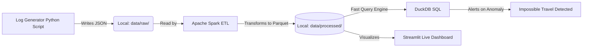

# Local Modern Data Stack: Cybersecurity Log Pipeline

This repository contains the architecture, scripts, and queries for a **100% Free, Local Modern Data Stack** pipeline. It is designed to process security logs (e.g., CloudTrail) and identify potential threats on your local machine without needing cloud accounts or incurring costs.

The pipeline specifically addresses the **"Impossible Travel"** cybersecurity use case: detecting users logging in from two geographically distant locations within a suspiciously short timeframe.

## Architecture

We use a modern, open-source local data stack:



## Tech Stack
*   **Ingestion:** Python (`os`, `json`)
*   **Storage / Datalake:** Local file system
*   **Transformation (ETL):** Apache Spark (`pyspark` running locally)
*   **Analysis:** DuckDB (OLAP in-process SQL engine)
*   **Visualization Dashboard:** Streamlit
*   **CI/CD:** GitHub Actions
*   **Testing:** Pytest

## Project Structure
*   [`generate_logs.py`](./generate_logs.py): Script that creates mock logs and writes them to `data/raw/`.
*   [`local_etl.py`](./local_etl.py): PySpark script that enforces schema, adds date partitions, and writes highly-compressed Parquet files to `data/processed/`.
*   [`duckdb_queries.py`](./duckdb_queries.py): Uses DuckDB to perform lightning-fast SQL analytics directly on the Parquet files.
*   [`dashboard.py`](./dashboard.py): An interactive Streamlit Web App providing a visual frontend to the DuckDB query engine.
*   [`tests/`](./tests/): Unit tests for the data generation logic.

## Setup Instructions

### Prerequisites
*   Python 3.8+ installed and configured.
*   Java installed (Required for PySpark to run. e.g. OpenJDK 11).

### 1. Install Requirements
Create a virtual environment (optional but recommended) and install dependencies.
```bash
pip install -r requirements.txt
```

### 2. Generate Raw Data
Run the data generator to create a batch of JSON logs.
```bash
python generate_logs.py
```

### 3. Run the PySpark ETL
Transform the messy JSON data into a clean, partitioned Parquet datalake.
```bash
python local_etl.py
```

### 4. Query with DuckDB
Use DuckDB to run advanced analytical SQL queries (`duckdb_queries.py`) against the Parquet directory structure to find the "Impossible Travel" anomalies in milliseconds.
```bash
python duckdb_queries.py
```

### 5. Launch the Live Analytics Dashboard (Streamlit)
Spin up the interactive web frontend to view the data engine visually:
```bash
streamlit run dashboard.py
```
This will automatically open a browser window displaying the Cyber Log threat tracking application.

## Running Tests
Run `pytest` to validate the logic of the logs and anomalies.
```bash
pytest tests/
```
