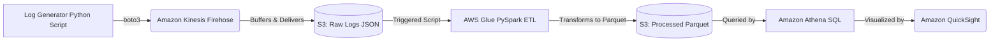

# Cloud-Native Cybersecurity Log Pipeline (Data Engineering Focus)

This repository contains the architecture, scripts, and queries for a cost-effective, automated ETL pipeline designed to process security logs (e.g., AWS CloudTrail, VPC Flow Logs) and identify potential threats. 

The pipeline specifically addresses the **"Impossible Travel"** cybersecurity use case: detecting users logging in from two geographically distant locations within a suspiciously short timeframe.

## Architecture

We use a modern, serverless streaming architecture:



## Tech Stack
*   **Infrastructure as Code:** Terraform
*   **Streaming Ingestion:** Amazon Kinesis Data Firehose
*   **Storage / Data Lake:** AWS S3
*   **Transformation:** AWS Glue (PySpark)
*   **Analysis:** Amazon Athena (SQL)
*   **CI/CD:** GitHub Actions
*   **Language & Testing:** Python, Pytest

## Files in this Project
*   [`terraform/`](./terraform/): IaC definitions for deploying the entire architecture.
*   [`generate_logs.py`](./generate_logs.py): Python script that generates mock logs and streams them to Kinesis Firehose.
*   [`glue_etl.py`](./glue_etl.py): PySpark script for AWS Glue to process JSON logs into partitioned Parquet.
*   [`athena_queries.sql`](./athena_queries.sql): SQL scripts to create external Athena tables and flag Impossible Travel.
*   [`cost_analysis.md`](./cost_analysis.md): A comprehensive monthly cost estimation.
*   [`tests/`](./tests/): Unit tests for the data generation logic.
*   [`.github/workflows/ci.yml`](./.github/workflows/ci.yml): GitHub Actions CI pipeline.

## Setup Instructions

### 1. Deploy Infrastructure (Terraform)
Ensure you have the AWS CLI configured and Terraform installed.
```bash
cd terraform
terraform init
terraform plan
terraform apply
```
This will automatically create the S3 buckets, Kinesis Firehose delivery stream, IAM Roles, Athena database, and the Glue Job. Note the outputs upon completion.

### 2. Stream Simulated Data
Run the dummy data generator locally to stream logs into Kinesis Firehose:
```bash
pip install -r requirements.txt
python generate_logs.py --stream <YOUR_FIREHOSE_STREAM_NAME>
```
*Note: Kinesis Firehose is configured to buffer for 60 seconds before dropping the file into the raw S3 bucket.*

### 3. Run the ETL Pipeline
1. Upload `glue_etl.py` to `s3://<your-raw-logs-bucket>/scripts/glue_etl.py` (Terraform configures the Glue job to look here).
2. Start the Glue job manually via the AWS Console or AWS CLI.

### 4. Query with Athena
1. Navigate to Amazon Athena.
2. Ensure you've selected the `cyber_security_logs` database created by Terraform.
3. Run the `CREATE EXTERNAL TABLE` statement from `athena_queries.sql`.
4. Run `MSCK REPAIR TABLE` to load the date partitions.
5. Run the "Impossible Travel" query to view results.

## Visualizing with Amazon QuickSight
To take this a step further and provide business value, connect QuickSight to Athena:
1. Open Amazon QuickSight and ensure it has permissions to access Athena and your S3 buckets.
2. Create a new Dataset, selecting **Athena** as the data source.
3. Select the `cyber_security_logs` database and your table.
4. Create a **Geospatial Map** visual using the `country` column.
5. Create a KPI visual to show the count of "Impossible Travel" flags over the last 24 hours.

## Local Testing & CI/CD
This project uses `pytest` for testing the anomaly generation logic and GitHub Actions for continuous integration.
To run tests locally:
```bash
pytest tests/
```
